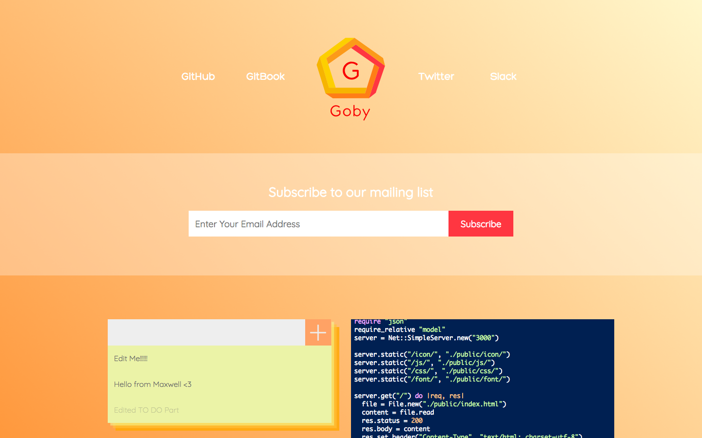

# Goby Sample Server APP - To Do List



## Requirement

- Docker
- Docker compose

## Usage

Clone it!

```
$ git clone git@github.com:goby-lang/sample-web-app.git
```

Go into the project directory and run the command:

```
$ docker-compose up
```

Open `http://localhost:3000` and enjoy!

## Frontend

- Start server - `$ yarn start`
- Rebuild index.js - `$ webpack`

## Contributors

- Creator of Goby @st0012
- Sample APP Maintainer @Maxwell-Alexius
- Logo Designer @steward
